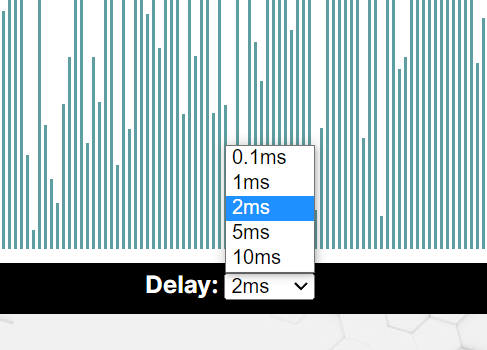

# Merge-Sort Visualier

Built with React. Click [here](https://hagayhaut.github.io/sorting-visualizer/) to view in the browser.

Features:
1. Generate new array.

2. Choose delay speed

3. And sort! 

Notice that compared values are red, view at 10ms to see how merge sort really works!

